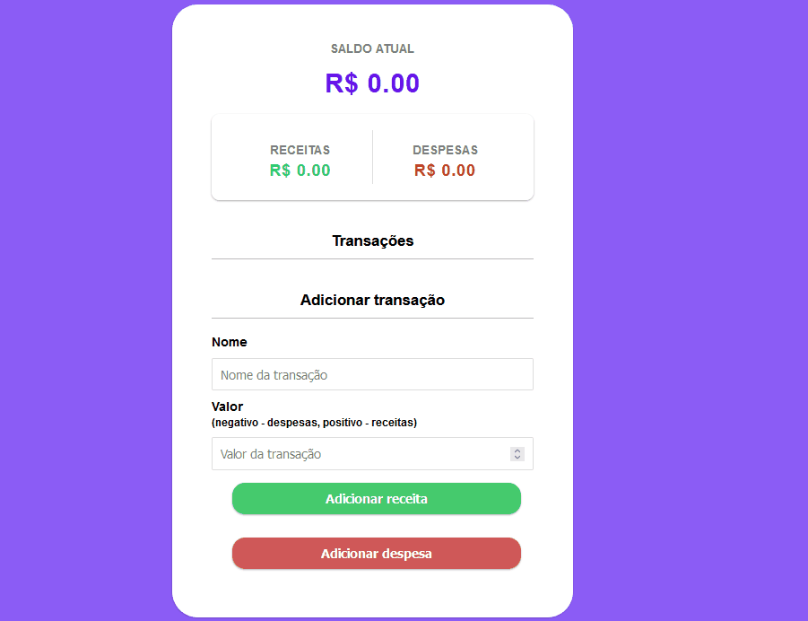

## 🧾 Descrição

Projeto para controle de despesas desenvolvido com HTML, CSS e JavaScript. Ele é uma aplicação web que permite adicionar e excluir transações financeiras e, em seguida, calcula o saldo atual e exibe as despesas e receitas em categorias separadas.

<h1>

## 🔌 Tecnologias utilizadas

- **HTML:** Versão mais recente da linguagem de marcação utilizada para estruturar o conteúdo da página web.
- **CSS:** Versão mais recente da linguagem de estilo utilizada para definir o layout e a aparência da página web.
- **JavaScript:** Linguagem de programação que permite criar interações dinâmicas na web. Com ela é possível manipular o conteúdo HTML e CSS em tempo real, validar formulários, criar animações, entre outras possibilidades.

## ⚙️ Estrutura

- **assets:** diretório onde ficam os recursos utilizados pela página, como imagens e ícones.
- **css:** arquivo com as regras de estilo da página.
- **img:** diretório onde ficam as imagens utilizadas na página.
- **script.js:** arquivo com o código JavaScript utilizado na página.
- **index.html:** arquivo HTML que contém o conteúdo da página web.

## 🏳️ Como executar?

### **Passo 1**
Faça download do repositório

### **Passo 2**
Abra o arquivo "Index.html" em um navegador e teste as funções.

 

## ✅ Resultado (Preview)

### **Saldo**

 

## 💻 Autor: Luan Ferreira

Portfólio:
- [Github](https://github.com/fluanbrito)

Contato:
- [Linkedin](https://www.linkedin.com/in/luanferreirab/)

<h1>

## 🚀 Sobre mim
Sou um grande entusiasta e apaixonado por tecnologia, empreendedorismo e inovação. Hoje, estou a cursar o curso de Sistema de Informação pelo Instituto Federal, faço uso profissionalmente de ferramentas e me aprofundo em temas como Marketing, Machine Learning AWS, Metodologias ágeis, Gestão de Projetos, Programação Web, Administração de Sistemas, Redes de computadores, entre outros.

